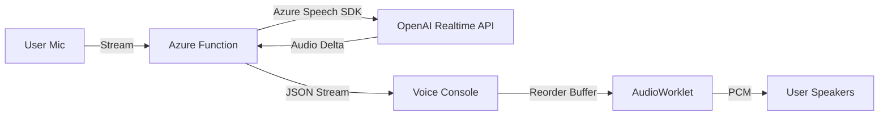

# Voice Subsystem Architecture

## Overview
The Voice Subsystem enables real-time, hands-free voice interaction between the specialist and the AI copilot. It uses a custom streaming pipeline designed to handle network jitter and ensure smooth audio playback even in unstable network conditions.

## Architecture



## Protocol
Communication happens over a standard HTTP Receive Loop (Streaming Response).

### Downlink (Server -> Client)
The server sends a stream of newline-delimited JSON objects.

**Format:**
```json
{
  "t": "audio",           // Type: audio | ready | clear | ping
  "d": "base64_data...",  // Payload (Base64 PCM 24kHz Mono)
  "s": 123                // Sequence Number (Incrementing Integer)
}
```

- **Sequence Number (`s`)**: Introduced to handle out-of-order packet delivery at the application level.
- **Audio Format**: Raw PCM, 24kHz, 16-bit, Mono.

## Frontend Implementation

### 1. Jitter Buffer Strategy
To prevent audio cuts ("choppy voice") and out-of-order artifacts ("robot voice"), the frontend implements a multi-stage buffering strategy:

1.  **Reorder Buffer (Main Thread)**
    *   Receives JSON packets.
    *   Uses the Sequence Number (`s`) to sort packets.
    *   Only releases packets to the audio thread when `expected` sequence is available.
    *   buffer: `Map<seq, data>`

2.  **AudioWorklet (Audio Thread)**
    *   `pcm-player.js` runs in a separate thread from the UI.
    *   Maintains a **Ring Buffer** of raw samples.
    *   Decouples network arrival time from audio rendering callback.

3.  **Start Gating**
    *   Playback does not start immediately upon receiving the first byte.
    *   The system waits until **300ms** of audio is buffered in the Worklet.
    *   This initial buffer absorbs network jitter during the critical start phase.

### 2. State Management (`VoiceConsole.tsx`)
- **Connecting**: Establishing stream.
- **Buffering**: Accumulating initial samples (300ms target).
- **Playing**: Draining the Worklet buffer.
- **Underrun**: If buffer runs dry, playback stops, and the system enters "Buffering" state again (with a larger safety margin, e.g., 600ms).

### 3. Barge-In Interruption
When the user speaks (or clicks Stop):
1.  Backend sends `t: clear`.
2.  Frontend:
    *   Clears `ReorderBuffer`.
    *   Sends `cmd: stop` to Worklet (clears Ring Buffer).
    *   Resets Sequence counters.

## Key Files
- `backend/functions/src/functions/consultVoiceListen.ts`: Stream source, injects sequence numbers.
- `frontend/portal/components/VoiceConsole.tsx`: Main controller, logic for Reorder Buffer & Gating.
- `frontend/portal/public/pcm-player.js`: AudioWorkletProcessor, Ring Buffer implementation.
